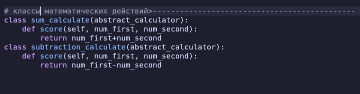

# -onsole calculator
   
<h3>Навигация</h3>

<ul>
<li><a href="#section1"><b>что это за проект?</b></a> </li>
<li><a href="#section2"><b>как и куда добавлять свои знаки?</b></a></li>
</ul>

   
   
   
<h4>что это за проект?</h4>
это консольный калькулятор написанный на пайтоне в который вы можете добавлять свои математические знаки, и убирать существующие   сейчас этот калькулятор умеет считать только простейшие примеры с неболее чем двумя числами, но я планирую его довести до того, что он будет решать сложные примеры, и уравнения, а ещё он сможет рисовать графики ваших функций прямо у вас в терминале
   
   
   
<h4>как и куда добавлять свои знаки?</h4>
что бы добавить свои знаки нужно открыть main.py в каком-нибудь редакторе кода, либо просто в блокноте и найти блок кода с классами математических действий
  
сюда вы можете вписывать свои классы 
либо если вы не знаете python, то эта инструкция для вас 
<a href="./docs/python_manual.md"><b>python_manual</b></a>
