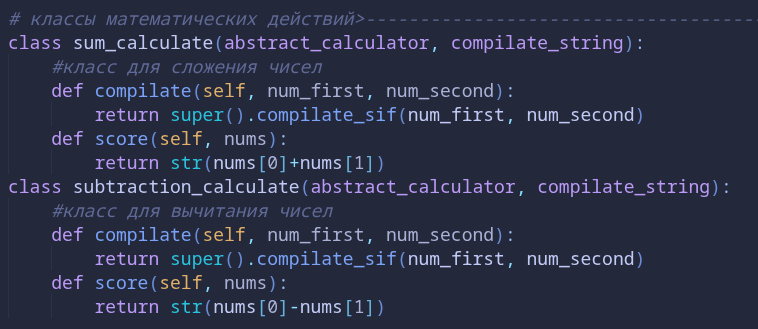

<h1>-onsole calculator</h1>

 

<h2>Навигация</h2>
<ul>
  <li>
    <a href="#aboutProject">
      <b>о проекте?</b>
    </a>
  </li>
  <li>
    <a href="#install">
      <b>install</b>
    </a>
  </li>
  <li>
    <a href="#mathSings">
      <b>добавление математическиз знаков?</b>
    </a>
  </li>
  <li>
    <a href="#future">
      <b>будущие нововведения</b>
    </a>
  </li>
</ul>

 
 
 

<h2 id="aboutProject">
  о чём этот проект
</h2>

  этот проект представляет собой консольный калькулятор написанный на пайтоне
   соблюдая пять методов SOLID,
   в этом калькуляторе у вас появляется возможность создавать свои
   математические знаки, которые будут работать по вашим сценариям
   а так же вы можете убирать существующие математические знаки,

   так же в будущем мы хотим дать пользователю возможность писать полностью
   свои математические конструкции, которые дадут возможность
   тонко настраивать калькулятор под свои задачи

    

<h2 id="install">
  install
</h2>

  

    
<h3>Linux</h3>

    

      

        
arch подобные

        

          
<b>
            AUR
          </b>

            
ещё нету

        

      

      

        
debian подобные

        

        
ещё не готово

        

      

      

        
NixOS

        

          
ещё не готово

        

      

      

        
other

        

          
инструкции ещё не готовы

        

      

    

  

  

    
<h3>Windows</h3>

    

      
ещё не готово

    

  

  

    
<h3>MacOS</h3>

    

      
ещё не готов

    

  

<h2 id="mathSings">
  как и куда добавлять свои знаки?
</h2>

  что бы вы могли добавить свои знаки нужно открыть файл main.py
   в каком-либо редакторе специлизируещемся на написании кода,
   либо в блокноте или любом другом приложении,
   в котором можно редактировать файлы;
    

  после того как вы открыли файл, нужно найти строчки как на фото,
   там есть разделитель в виде коментария, по нему можно определить
   является ли эти строчки тем, что вам нужно;
    

  если вы знаете язык программирования python, то читайте дальше,
   а если вы его не знаете, то рекомендую прочесть
  <a href="./docs/python_manual.md"> 
    <b>подробную инструкцию по добавлению своих математических знаков</b>
  </a>

  когда вы нашли нужный вам блок кода,
  вы можете добавить новый клас,
   операясь на шаблон

  
  
  

<h2 id="future">
  планы на будущее
</h2><ol>
  <li>добавление работы с выражениями содержащими скобки</li>
  <li>возможность построения графиков с помощью формул</li>
  <li>расширение математических конструкций колькулятора</li>
</ol>